# Lab2-HelloToast2

### Hello Toast2 Application working

- Application Index Portrait
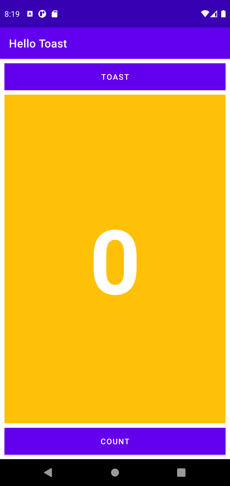

- Application Index Landscape
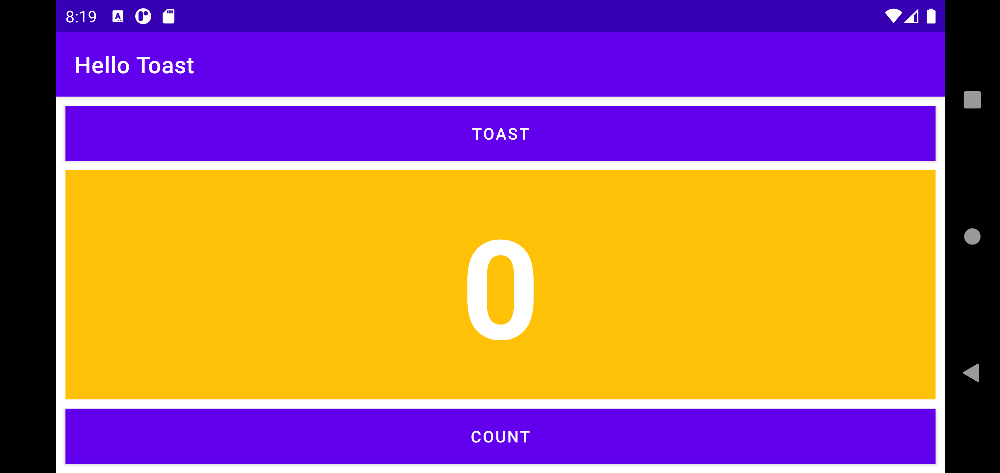

### Hello Toast2 Application Workings

- Count Button Portrait
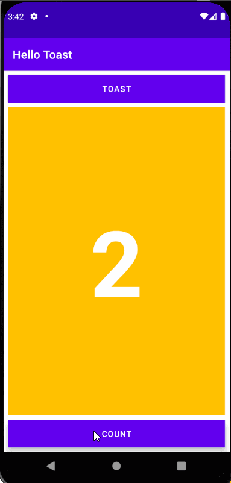

- Count Button Landscape
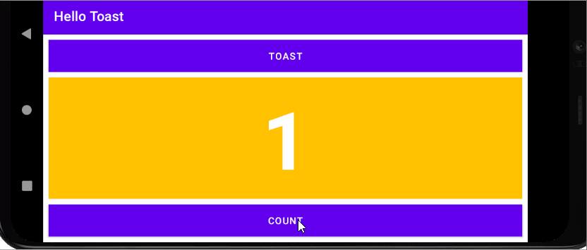

- Count Button Tablet Landscape

- Toast Button Portrait
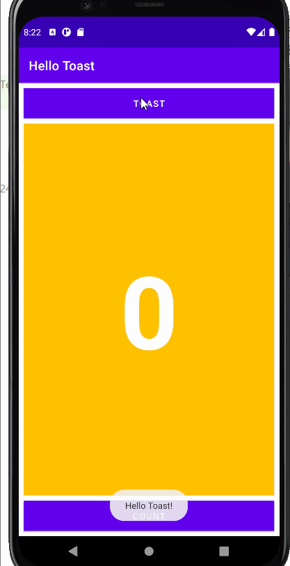

- Toast Button Landscape
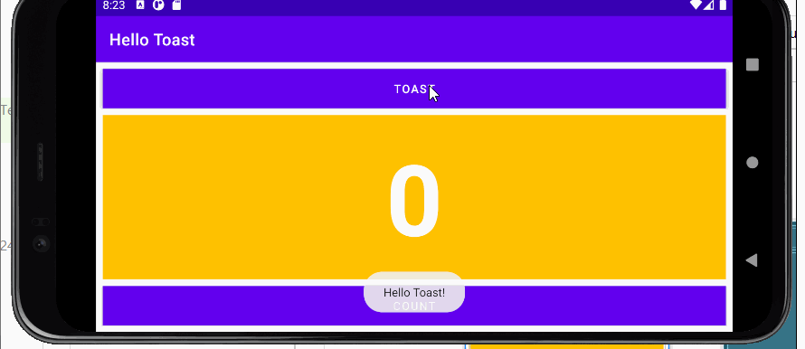

- Toast Button Tablet Landscape
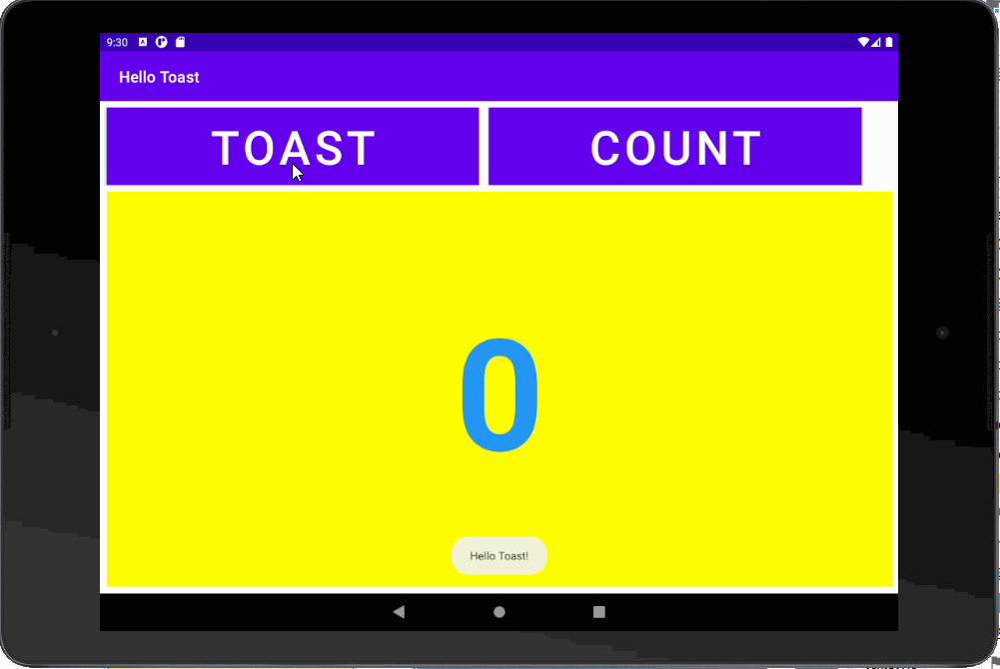

# Lab-2-HelloToastChallenge2

### Hello ToastChallenge 2 Application Overview

- Application Index (Linear Layout)
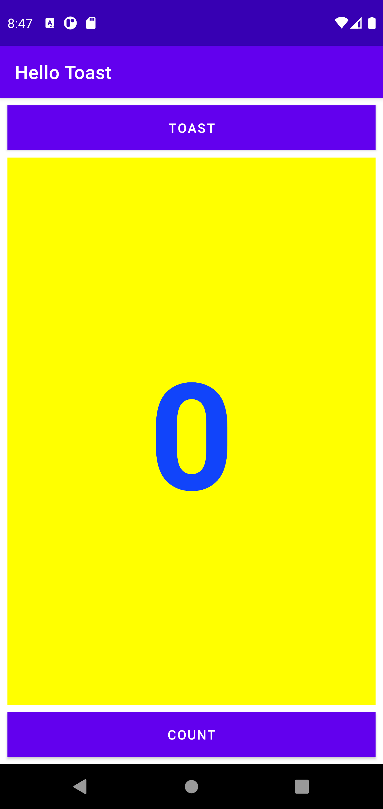

- Application Index (Relative Layout)
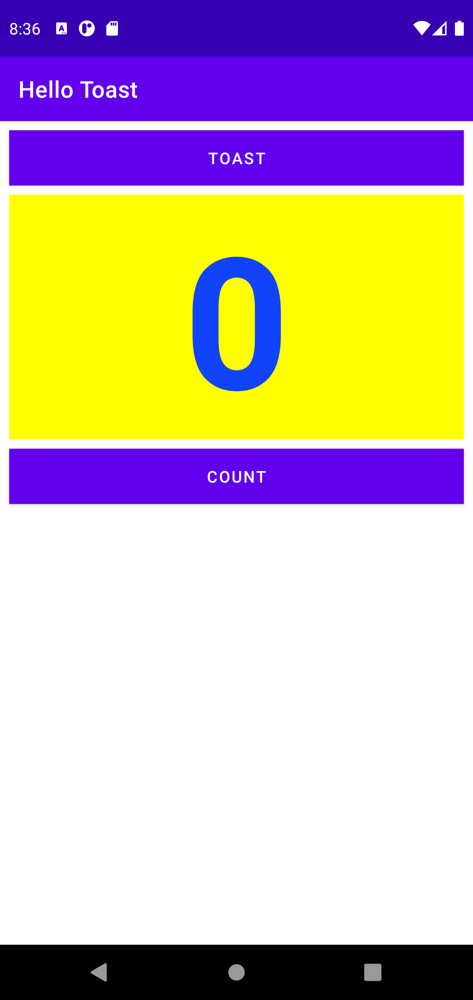

### Hello Toast Challenge2 Application Workings

- Count Button for Linear Layout
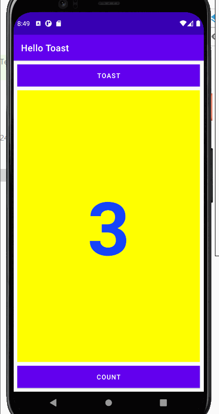

- Count Button for Relative Layout
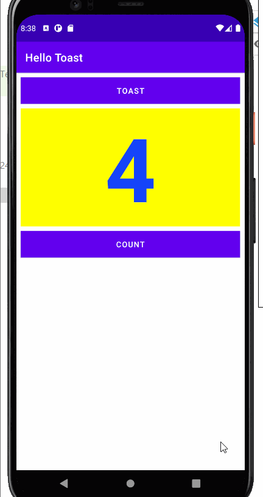

- Toast Button for Linear Layout
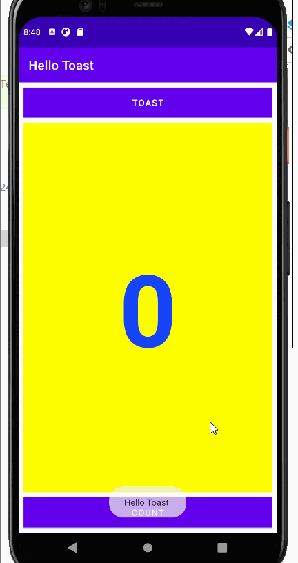

- Toast Button for Relative Layout

# Lab-2-HelloConstraint

## HelloConstraint Application 

- Application Index Portrait
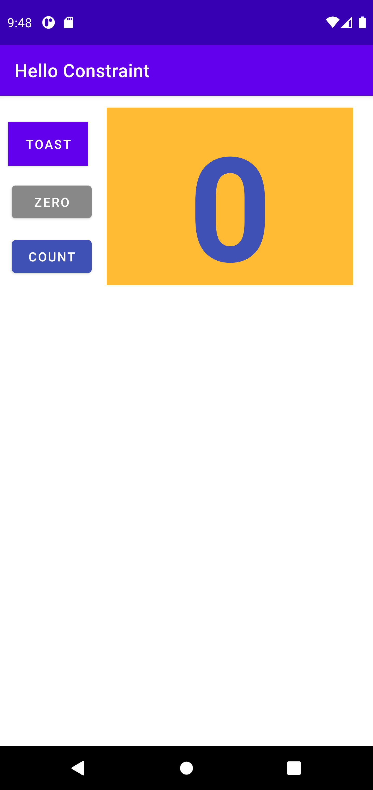

- Application Index Landscape
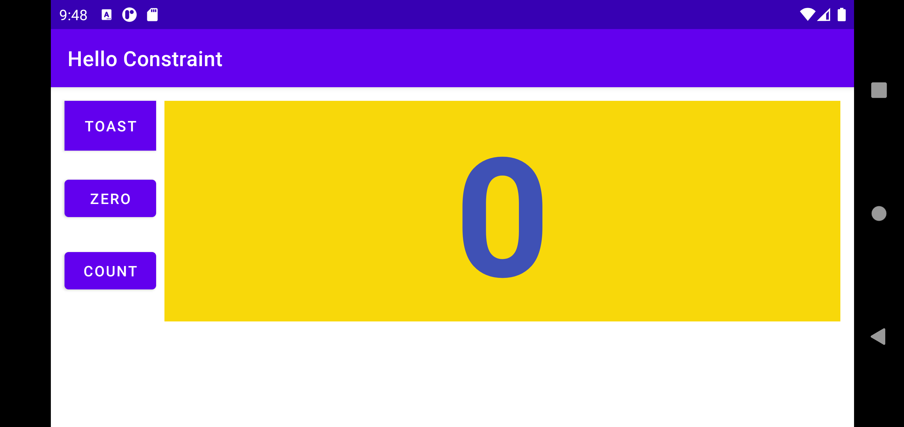

### HelloConstraint Application Workings

- Count Button working in  Portrait
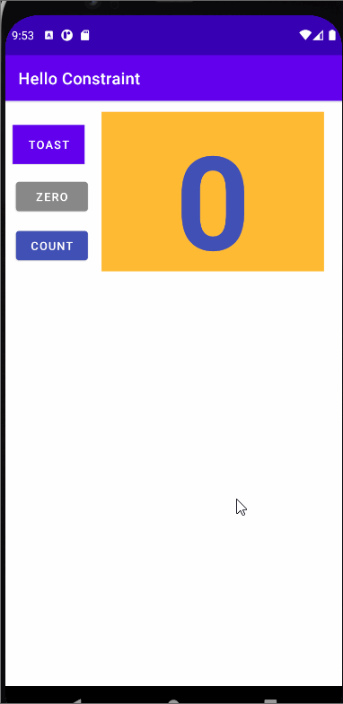

- Count Button working in Landscape
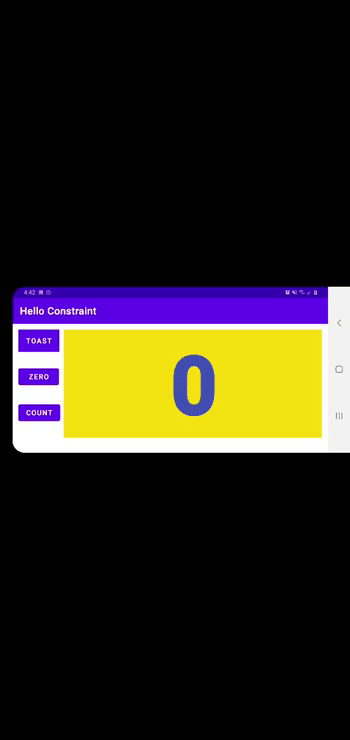

- Zero Button when Portrait
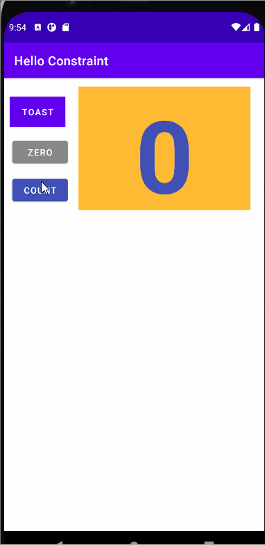

- Zero Button when Landscape

