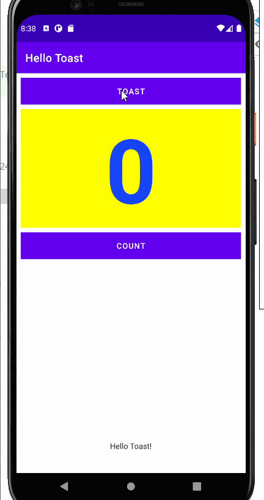
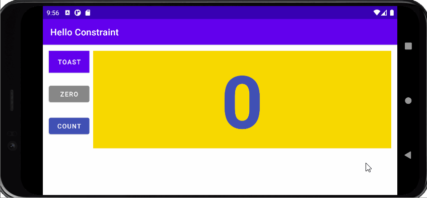

# Lab2-HelloToast2

### Hello Toast2 Application working

- Application Index Portrait

- Application Index Landscape

### Hello Toast2 Application Workings

- Count Button Portrait

- Count Button Landscape

- Count Button Tablet Landscape

- Toast Button Portrait

- Toast Button Landscape

- Toast Button Tablet Landscape

# Lab-2-HelloToastChallenge2

### Hello ToastChallenge 2 Application Overview

- Application Index (Linear Layout)

- Application Index (Relative Layout)

### Hello Toast Challenge2 Application Workings

- Count Button for Linear Layout

- Count Button for Relative Layout

- Toast Button for Linear Layout

- Toast Button for Relative Layout

# Lab-2-HelloConstraint

## HelloConstraint Application 

- Application Index Portrait

- Application Index Landscape

### HelloConstraint Application Workings

- Count Button working in  Portrait

- Count Button working in Landscape

- Zero Button when Portrait

- Zero Button when Landscape

